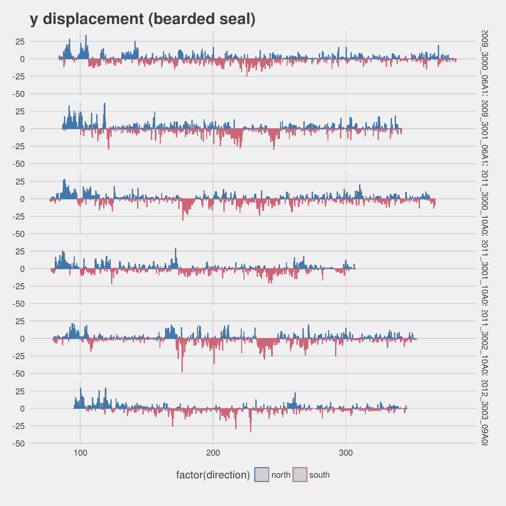
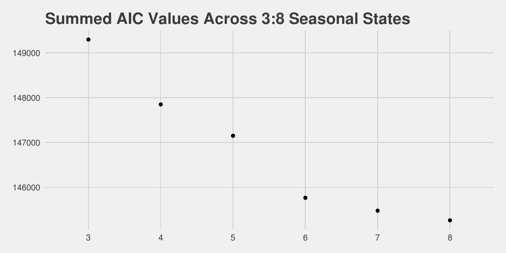
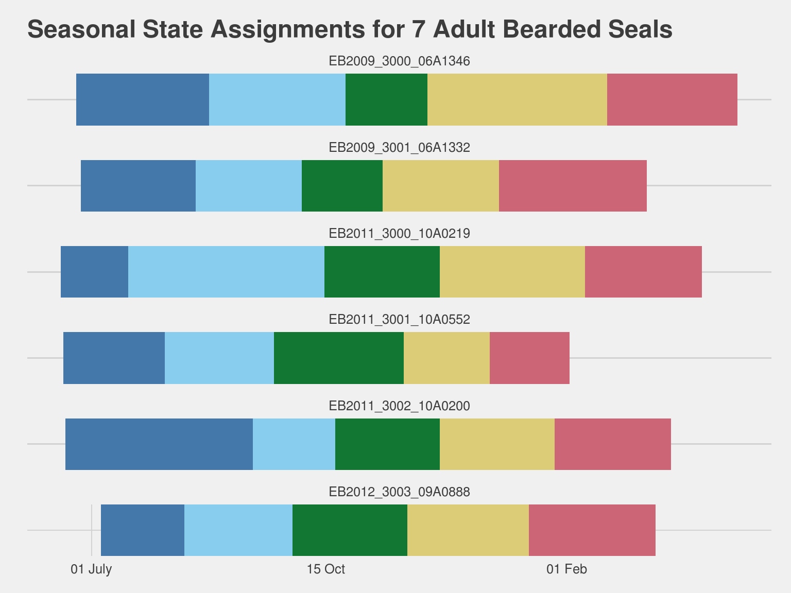
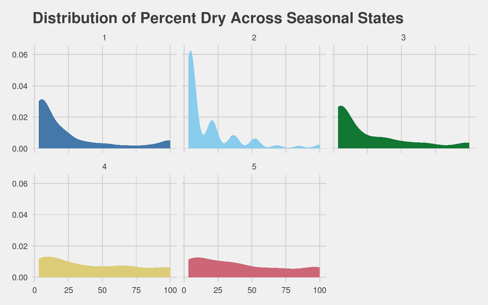
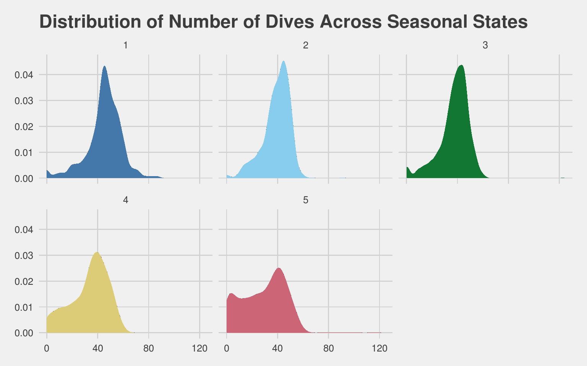
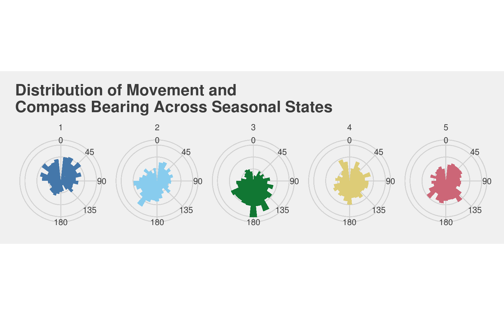

# Estimating Seasonal Behavior States from Biologging Sensor Data
`r format(Sys.time(), '%d %B, %Y')`  

## Introduction

The seasonal timing of key, annual life history events is an important component of many species' ecology and evolutionary history. Highly migratory species time their arrival at locations to coincide with favorable environmental conditions or peaks in prey availability. Non-migratory species in highly seasonal zones have adapted to time important events such as reproduction and rearing of young with more favorable seasons. Both of these strategies are present in the Arctic ecosystem. As the climate warms and seasonal timing changes, how well Arctic animals adjust their phenology will be an important response. Unfortunately, many Arctic species are widley dispersed and exist in inaccessible or remote habitats. Observing Arctic species with the regularity and precisions required to establish phenological patterns is a significant challenge.

Arctic seal species (e.g., bearded seal, ringed seal, ribbon seal) are classified as ice-associated or ice-obligate in recognition of their reliance on sea-ice for key annual events such as pupping, weaning, and molting. Sea-ice habitat availability for these species is highly seasonal and each species has adapted their annual cycles and behaviors to best optimize their use of this habitat. Ringed seals rely on fast ice and surface snow accumulation to construct lairs where pups are born and sheltered from the weather and predators. In years when snow melt begins early, lairs are subject to collapse and pups are more susceptible to predation and exposed to the elements. Ribbon seals are mostly pelagic throughout the year but are closely associated with the marginal sea-ice zone during pupping, breeding, weaning, and molting. All of these critical events are compressed into just a few months that coincide with maximum sea-ice extent in the Bering Sea and the initial melt period. Bearded seals are more closely associated with sea-ice throughout the year, but their use of sea-ice as a haul-out platform changes. Many bearded seals in the North Pacific will move through the Bering Strait into the Bering Sea as sea ice advances in the late fall and then back up into the Chukchi and Beaufort seas as it retreats in early summer.

Seasonal periods important to these seals (and other marine species) often do not align well with typical labels (i.e., spring, summer, winter, fall). The timing of key life history events is well documented only for species found in accessible habitats or breeding areas. Long term studies have documented such critical parameters as the timing of migration, arrival timing of breeders, peak pupping or hatching, and molting. Our knowledge of seasonal timing for species widely dispersed in inaccessible or remote habitats, however, is poor.

The deployment of bio-logging telemetry devices has been key tool for understanding the ecology and behavior of animals. And, has been an especially critical tool for studies of wide ranging species in remote locations. For marine mammals, and especially pinnipeds, bio-loggers are typically recording behavioral parameters (e.g., dive behavior, haul-out behavior, foraging events) that are expected to vary across seasons and life history events. The critical life history events of these seals are all associated with increased haul-out behavior and changes in dive behavior. Additionally, migratory-like movements are also key indications of seasonal states. By examining these behavioral parameters and information related to animal movement in a single, multivariate framework, the number of seasons and the timing of change can be estimated.

We propose using a multivariate hidden semi-Markov model (mhsmm) as an approach to identifying key seasonal periods and the timing of those seasons from bio-logging data. The hidden Markov model (hmm) is used frequently in the study of animal movement. In most cases, the hmm is used to identify states such as foraging, resting, or transit from characteristic movement (step-length and turning angle). In a few cases, additional behavior data has been incorporated to futher improve the model inference. While a few have proposed and implemented the use hidden semi-Markov models as better approaches for understanding wildlife behavior, they have not been previously implemented as a means for estimating seasonal level states. Hidden Markov models require a geometrically distributed sojourn time in a given state. Hidden semi-Markov models allow an arbitrary sojourn distribution --- the duration an animal spends in a state can depend on the time it has already spent in that state. O’Connell et al (2010) applied Hidden semi-Markov models to the estrus detection in dairy cows and developed the `mhsmm` library for R to support similar analyses.

> insert background and more discussion on hmm, hsmm, and mhsmm

## Methods and Analysis

Between 2009 and 2012 seven adult bearded seals were captured and released with bio-logging devices that provide measures of movement, dive behavior, and hourly wet-dry proportions. The tags were deployed in June and July with deployment duration ranging from 229.990463 to 301.9618171 days (median = 257.5183333 days). Data from these deployments are available as an R data package and we will use these data to demonstrate the application of multivariate hidden semi-Markov models to identify seasonal states from real world telemetry data.

The `kotzeb0912` R package contains telemetry data from 14 deployments on seven adult bearded seals. Each seal was deployed with two tags --- one adhered to the hair on the head of the animal and another attached to the flipper. The flipper attached tags were removed from the dataset for this analysis. All of the telemetry data was transmitted via the Argos satellite system and processed through the Wildlife Computers Data Portal. The location data consist of coordinates estimated via Argos along with the associated error ellipses as well as locations derived from the FastLoc GPS sensor on three of the deployments. Error for the FastLoc GPS coordinates was presumed to be a fixed value of 50 meters. Behavior data of interest for this analysis includes histograms of maximum dive depths within a 6 hour period and the percentage of each hour the tag was dry.

### Modeling Movement and Aligning Data

A key parameter in the evaluation of seasonal states will be movement --- specifically, the displacement in x and y coordinates at each time step. Location data from bio-logging devices are provided at irregular time steps and with varying error associated with each location estimate. The `crawl` R package was employed to model seal movement and estimate locations every 6 hours throughout the deployment. Prior to modeling the movement with `crawl`, the `argosfilter` package provided a course speed filter (vmax=3.5 m/s) to eliminate obvious outlier locations. Predicted locations are specified from the posterior mean and variance of the model track and coincide with the mid-point of the 6-hour dive behavior histograms. The lag difference in x and y coordinates provides a measure of northing and easting displacement at each time step. These values will form the basis for our xy-displacement multi-variate normal parameter in the model.

The haul-out behavior timelines are provided as hourly percent-dry values and were grouped into 6-hour blocks that are centered on our 6-hourly predictions. Dive behavior data are transmitted as dive histograms that represent the distribution of dives across predetermined depth bins for a given 6-hour period. To simplify things, the number of dives across all bins less than 10 meters are summed. The expectation is this will accurately represent the number of foraging dives over a 6 hour period. Both of these behavioral data streams are subjet to periods of missing data. Since these deployments occurred over multiple years, the number of days since 1 April was used as a standard time scale. 

This series of five plots shows the raw, 'observed' parameter values that will go into the model: haul-out status, number of dives, y-displacement, and x-displacement.

<!-- -->

Figure 1: observed haul-out status parameter values from bio-logging devices deployed on seven adult bearded seals

<!-- -->

Figure 2: observed number of dives below 10 meters reported from bio-logging devices deployed on seven adult bearded seals

<!-- -->

Figure 3: estimated y-displacement per six hours based on movements of seven adult bearded seals

<!-- -->

Figure 4: estimated x-displacement per six hours based on movements of seven adult bearded seals

### Multivariate Hidden semi-Markov Model

The R package `mhsmm` provides a framework for multi-variate hidden semi-Markov models. The package provides support for a few selected emmission distributions (Poisson, normal, and multi-variate normal). For dive behavior (i.e., number of dives below 10m), a Poisson emmission distribution was used and a multi-variate normal was used for the combined x-y displacement. A Bernouli distribution was used for haul-out status. Custom M-step functions were written to extend the package in support of the Bernouli as well as provide support for missing values in the Poisson and multi-variate normal.

In order to mimic the seasonal progression, we fixed the transition matrix with all superdiagonal entries set to 1 and the remaining entries set to 0. The transition matrix was not be re-estimated and the initial state was set to state 1. Initial values for the other parameters were generally set to a reasonable value and repeated across all states (table 1). A shifted Poisson distribution was chosen for the initial sojourn values and the lambda value was set to the number of time steps divided by the number of time steps. This initiates the model with a constant sojourn value distributed evenly across the deployment. The shift parameter was set to 0 for all states.

### Model Selection

The key, unknown parameter in this analysis is the number of seasonal states. In an ideal situation, we would have some a priori knowledge regarding number of seasonal states and our modeling effort would focus on the timing and duration of those known number of states. For some, well-studied species, this might be possible. Even for less studied species like bearded seals, we know their seasonal cycle includes a period for pupping and breeding in approximately April/May, followed by a molt period that can extend into July. The remainder of the year is less understood and, in the case of this study, the bio-logger deployments mostly cover this less-known period.

We used AIC as a possible indicator of an optimal number of seasonal states. The number of states was varied from three to eight and AIC was evaluated for each individual deployment as well as a sum across all deployments.

<!-- -->

Figure 5: comparison of AIC values from the mhsmm model fit for each deployment and varying numbers of states (3:8)

<!-- -->

Figure 6: comparison of AIC values from the mhsmm model fit summed across deployments for varying numbers of states (3:8)

Relying on the summed AIC values alone would suggest eight (or more) seasonal states. However, with that many states it becomes difficult to assign ecological and behavioral meaning to those states. There are also valid concerns regarding the applicability of AIC as a model selection tool for hidden-Markov models as well as a tendency towards over-fitting. 

In the end, a combination of ecological intuition, some knowledge of bearded seal behavior and ecology, and the pattern in AIC values led us to settle on 6 seasonal states. This seems reasonable given our understanding bearded seal ecology and the largest delta-AIC value was observed when increasing from 5 to 6 states.

### Model Fitting and State Prediction

--------------------------------------------------------------------
 state   haul_out   n_dives   xy_disp   S_type   S_lambda   S_shift 
------- ---------- --------- --------- -------- ---------- ---------
   1       0.1        30        0,0    poisson   nrows/6       0    

   2       0.1        30        0,0    poisson   nrows/6       0    

   3       0.1        30        0,0    poisson   nrows/6       0    

   4       0.1        30        0,0    poisson   nrows/6       0    

   5       0.1        30        0,0    poisson   nrows/6       0    

   6       0.1        30        0,0    poisson   nrows/6       0    
--------------------------------------------------------------------

### Adult Bearded Seals

We can plot the state assignments for each bearded seal

<!-- -->

We can also combine the state assignments across our tagged seals by taking the majority state for each time step. The color transparency is set to the proportion of animals represented by that majority state. Note that, some states may not be present in the combined graph.

<!-- -->

Now that we have some seasonal states assigned, we can examine the distribution of various behaviors across those different states.

<!-- -->

<!-- -->

<!-- -->

## Discussion

## References
