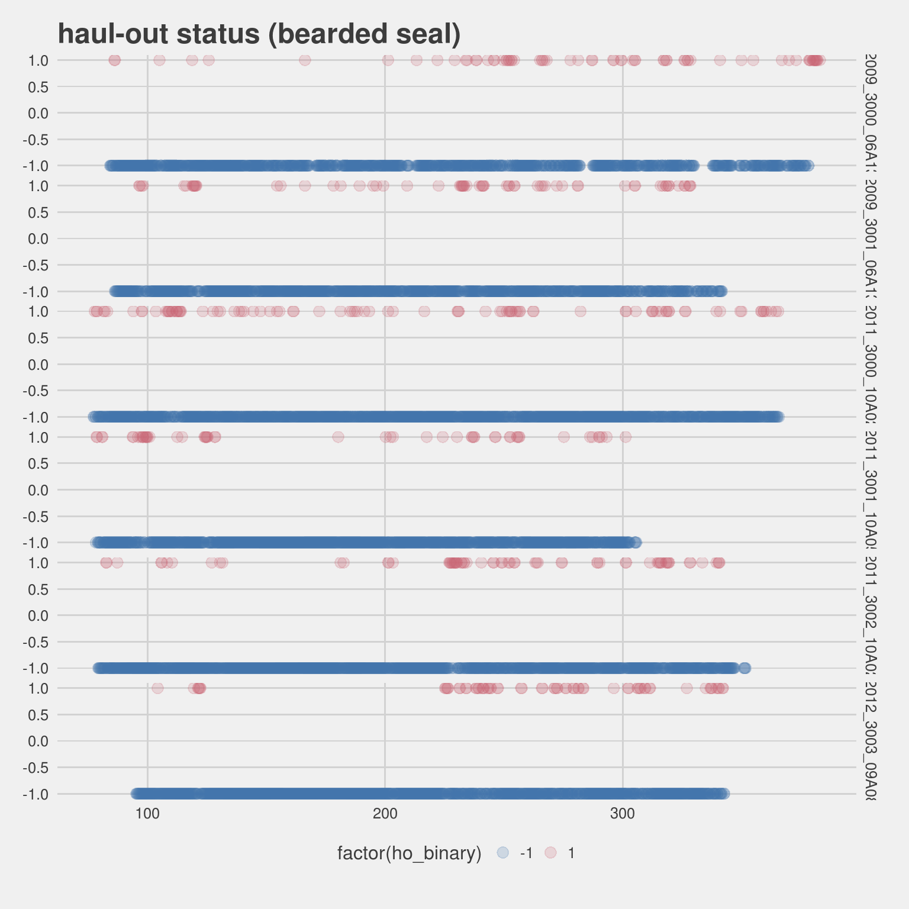
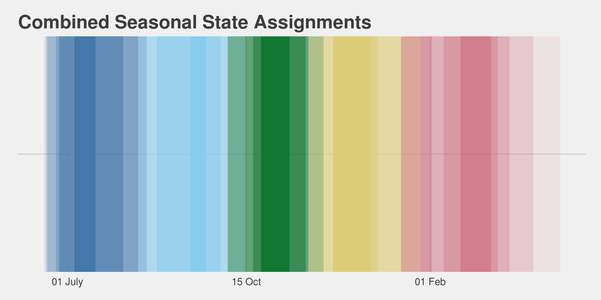

# Estimating Seasonal Behavior States from Biologging Sensor Data
`r format(Sys.time(), '%d %B, %Y')`  


## Introduction

The seasonal timing of key, annual life history events is an important component of many species' ecology and evolutionary history. Highly migratory species time their arrival at locations to coincide with favorable environmental conditions or peaks in prey availability. Non-migratory species in highly seasonal zones have adapted to time important events such as reproduction and rearing of young with more favorable seasons. Both of these strategies are present in the Arctic ecosystem. As the climate warms and seasonal timing changes, how well Arctic animals adjust their phenology will be an important response. Unfortunately, many Arctic species are widley dispersed and exist in inaccessible or remote habitats. Observing Arctic species with the regularity and precisions required to establish phenological patterns is a significant challenge.

Arctic seal species (e.g., bearded seal, ringed seal, ribbon seal) are classified as ice-associated or ice-obligate in recognition of their reliance on sea-ice for key annual events such as pupping, weaning, and molting. Sea-ice habitat availability for these species is highly seasonal and each species has adapted their annual cycles and behaviors to best optimize their use of this habitat. Ringed seals rely on fast ice and surface snow accumulation to construct lairs where pups are born and sheltered from the weather and predators. In years when snow melt begins early, lairs are subject to collapse and pups are more susceptible to predation and exposed to the elements. Ribbon seals are mostly pelagic throughout the year but are closely associated with the marginal sea-ice zone during pupping, breeding, weaning, and molting. All of these critical events are compressed into just a few months that coincide with maximum sea-ice extent in the Bering Sea and the initial melt period. Bearded seals are more closely associated with sea-ice throughout the year, but their use of sea-ice as haul-out platform changes. Many bearded seals in the North Pacific will move through the Bering Strait into the Bering Sea as sea ice advances in the late fall and then back up into the Chukchi and Beaufort seas as it retreats in early summer.

Seasonal periods important to these seals (and other marine species) often do not align well with typical labels (i.e., spring, summer, winter, fall). The timing of key life history events is well documented only for species found in accessible habitats or breeding areas. Long term studies have documented such critical parameters as the timing of migration, arrival timing of breeders, peak pupping or hatching, and molting. Our knowledge of seasonal timing for species widely dispersed in inaccessible or remote habitats, however, is poor.

The deployment of bio-logging telemetry devices has been key tool for understanding the ecology and behavior of animals. And, has been an especially critical tool for studies of wide ranging species in remote locations. For marine mammals, and especially pinnipeds, bio-loggers are typically recording behavioral parameters (e.g., dive behavior, haul-out behavior, foraging events) that are expected to vary across seasons and life history events. The critical life history events of these seals are all associated with increased haul-out behavior and changes in dive behavior. Additionally, migratory-like movements are also key indications of seasonal states. By examining these behavioral parameters and information related to animal movement in a single, multivariate framework, the number of seasons and the timing of change can be estimated.

We propose using a multivariate hidden semi-Markov model (mhsmm) as an approach to identifying key seasonal periods and the timing of those seasons from bio-logging data. The hidden Markov model (hmm) is used frequently in the study of animal movement. In most cases, the hmm is used to identify states such as foraging, resting, or transit from characteristic movement (step-length and turning angle). In a few cases, additional behavior data has been incorporated to futher improve the model inference. While a few have proposed and implemented the use hidden semi-Markov models as better approaches for understanding wildlife behavior, they have not been previously implemented as a means for estimating seasonal level states. Hidden Markov models require a geometrically distributed sojourn time in a given state. Hidden semi-Markov models allow an arbitrary sojourn distribution --- the duration an animal spends in a state can depend on the time it has already spent in that state. O’Connell et al (2010) applied Hidden semi-Markov models to the estrus detection in dairy cows and developed the `mhsmm` library for R to support similar analyses.

> insert background and more discussion on hmm, hsmm, and mhsmm


Between 2009 and 2012 seven adult bearded seals were captured and released with bio-logging devices that provide measures of movement, dive behavior, and hourly wet-dry proportions. The tags were deployed in June and July with deployment duration ranging from 229.990463 to 301.9618171 days (mean = 265.8082556 days). Data from these deployments are available as an R data package and we will use these data to demonstrate the application of multivariate hidden semi-Markov models to identify seasonal states from real world telemetry data.

## Methods and Analysis

The `kotzeb0912` R package contains telemetry data from 14 deployments on seven adult bearded seals. Each seal was deployed with two tags --- one adhered to the hair on the head of the animal and another attached to the flipper. The flipper attached tags were removed from the dataset for this analysis. All of the telemetry data was transmitted via the Argos satellite system and processed through the Wildlife Computers Data Portal. The location data consist of coordinates estimated via Argos along with the associated error ellipses as well as locations derived from the FastLoc GPS sensor on three of the deployments. Error for the FastLoc GPS coordinates was presumed to be a fixed value of 50 meters. Behavior data of interest for this analysis includes histograms of maximum dive depths within a 6 hour period and the percentage of each hour the tag was dry.

### Modeling Movement and Aligning Data

The `crawl` R package was employed to model seal movement and estimate locations every 6 hours throughout the deployment. Prior to modeling the movement with `crawl`, the `argosfilter` package provided a course speed filter (vmax=3.5 m/s) to eliminate obvious outlier locations. Predicted locations are specified from the posterior mean and variance of the model track and coincide with the mid-point of the 6-hour dive behavior histograms. The haul-out behavior timelines are provided as hourly percent-dry values and were grouped into 6-hour blocks that are centered on our 6-hourly predictions. Dive behavior data are transmitted as dive histograms that represent the distribution of dives across predetermined depth bins for a given 6-hour period. To simplify things, the number of dives across all bins less than 10 meters are summed. The expectation is this will accurately represent number of foraging dives over a 6 hour period. 


```r
data("kotzeb0912_depths")
data("kotzeb0912_timelines")

kotzeb0912_locs <- kotzeb0912_locs %>% 
  dplyr::select(deployid,date_time=unique_posix,instr,
                quality,latitude,longitude,error_radius,
                error_semimajor_axis,
                error_semiminor_axis,
                error_ellipse_orientation) %>% 
  dplyr::filter(instr == "Mk10")  

kotzeb0912_depths <- kotzeb0912_depths %>% 
  dplyr::filter(deployid %in% kotzeb0912_locs$deployid) %>% 
  dplyr::rename(date_time=datadatetime)

kotzeb0912_timelines <- kotzeb0912_timelines %>% 
  dplyr::filter(deployid %in% kotzeb0912_locs$deployid) %>% 
  dplyr::rename(date_time=datadatetime)

locs <- kotzeb0912_locs
depths <- kotzeb0912_depths
drytimes <- kotzeb0912_timelines

locs <- locs %>% 
  mutate(species = ifelse(grepl("^EB.",deployid),'Bearded seal',NA)) %>% 
  dplyr::filter(!is.na(species)) %>% arrange(deployid,date_time)

depths <- depths %>% 
  mutate(species = ifelse(grepl("^EB.",deployid),'Bearded seal',NA)) %>% 
  dplyr::filter(!is.na(species)) %>% arrange(deployid,date_time)

drytimes <- drytimes %>% 
  mutate(species = ifelse(grepl("^EB.",deployid),'Bearded seal',NA)) %>% 
  dplyr::filter(!is.na(species)) %>% arrange(deployid,date_time)
```


```r
# speedfilter using the paralell package for multi-core speed
cfilter<-mclapply(split(locs,locs$deployid),function(x) sdafilter(
  lat=x$latitude, lon=x$longitude, dtime=x$date_time,
  lc=x$quality, ang=-1,vmax=3.5),mc.preschedule=F,mc.cores=3)
cfilter<-do.call("c",cfilter)
cfilter<-as.vector(cfilter)
locs$filtered <- cfilter

locs_data <- filter(locs,filtered=="not") %>% arrange(deployid,date_time) %>% 
  as.data.frame(.)
```


```r
data("kotzeb0912_gps")

kotzeb0912_gps <- kotzeb0912_gps %>% 
  mutate(species = "Bearded seal") %>% 
  select(deployid,species,date_time,latitude,longitude) %>% 
  filter(!is.na(latitude)) %>% 
  mutate(error_semimajor_axis = 50,error_semiminor_axis = 50, error_ellipse_orientation = 1) 

locs_data <- locs_data %>% bind_rows(kotzeb0912_gps) %>% 
  arrange(deployid,date_time)

locs_data_ellipse<- filter(locs_data,!is.na(error_semimajor_axis)) %>% 
  arrange(deployid,date_time)
```


```r
data <- as.data.frame(locs_data_ellipse)
coordinates(data) = ~longitude+latitude
proj4string(data) = CRS("+proj=longlat +datum=WGS84")

data=spTransform(data, CRS("+init=epsg:3571"))

## Loop over PTT and fit CTCRW models
ids = unique(data@data$deployid)

library(doParallel)
n.cores <- detectCores()
registerDoParallel(cores=3)

model_fits_ellipse <-
  foreach(i = 1:length(ids)) %dopar% {
  id_data = subset(data,deployid==ids[i])
  diag_data = model.matrix(
      ~ error_semimajor_axis + error_semiminor_axis + error_ellipse_orientation,
      id_data@data
    )[,-1]
    
    id_data@data = cbind(id_data@data, 
                         argosDiag2Cov(
                           diag_data[,1], 
                           diag_data[,2], 
                           diag_data[,3]))
    
    init = list(a = c(coordinates(id_data)[1,1],0,
                      coordinates(id_data)[1,2],0),
                P = diag(c(5000 ^ 2,10 * 3600 ^ 2, 
                           5000 ^ 2, 10 * 3600 ^ 2)))
    
  fit <- crwMLE(
      mov.model =  ~ 1,
      err.model = list(
        x =  ~ ln.sd.x - 1, 
        y =  ~ ln.sd.y - 1, 
        rho =  ~ error.corr
      ),
      data = id_data,
      Time.name = "date_time",
      initial.state = init,
      fixPar = c(1,1,NA,NA),
      theta = c(log(10), 3),
      initialSANN = list(maxit = 2500),
      control = list(REPORT = 10, trace = 1)
    )
    fit
  }

names(model_fits_ellipse) <- ids
```


```r
predData_ellipse <- foreach(i = 1:length(model_fits_ellipse)) %dopar% {
  if(!inherits(model_fits_ellipse[[i]],"try-error")) {
  model_fits_ellipse[[i]]$data$date_time <- lubridate::with_tz(
    model_fits_ellipse[[i]]$data$date_time,"UTC")
  predTimes <- seq(
    lubridate::ceiling_date(min(model_fits_ellipse[[i]]$data$date_time),"day"),
    lubridate::floor_date(max(model_fits_ellipse[[i]]$data$date_time),"day"),
    "6 hours")
  tmp = crwPredict(model_fits_ellipse[[i]], predTime=predTimes)
  } else return(NA)
}

predData_ellipse <- Filter(function(x) inherits(x,"crwPredict"),predData_ellipse)

predData_ellipse <- dplyr::bind_rows(predData_ellipse) %>% 
  filter(locType=="p")

predData <- predData_ellipse

predData$predTimes <- intToPOSIX(predData$TimeNum)
```


```r
diveData <- depths %>% 
  filter(bin != "bin1") %>% 
  mutate(date_time = date_time + hours(3)) %>% 
  group_by(deployid,date_time) %>% 
  summarise(num_dives=sum(num_dives,na.rm=TRUE)) %>% 
  ungroup()

predData <- dplyr::left_join(predData,diveData) %>% 
  arrange(deployid,date_time) 
```

### Movement Bearing

The lag difference in x and y coordinates provides a measure of northing and easting displacement at each time step. These displacement parameters can be used to, then, determine the compass bearing of each movement step. Compass bearing provides a more user friendly, interpretable description of movement compared to x/y displacement. These values will form the basis for our xy-displacement multi-variate normal parameter in the model.


```r
predData <- predData %>% 
  group_by(deployid) %>% 
  mutate(x_disp = order_by(date_time, mu.x - lag(mu.x)), 
         y_disp = order_by(date_time, mu.y - lag(mu.y))
  ) %>% 
  filter(!is.na(x_disp) | !is.na(y_disp)) %>% 
  ungroup()
```


```r
anglefun <- function(xx,yy,bearing=TRUE,as.deg=FALSE){
  ## calculates the compass bearing of the line between two points
  ## xx and yy are the differences in x and y coordinates between two points
  ## Options:
  ## bearing = FALSE returns +/- pi instead of 0:2*pi
  ## as.deg = TRUE returns degrees instead of radians
  c = 1
  if (as.deg){
    c = 180/pi
  }
  
  b<-sign(xx)
  b[b==0]<-1  #corrects for the fact that sign(0) == 0
  tempangle = b*(yy<0)*pi+atan(xx/yy)
  if(bearing){
    #return a compass bearing 0 to 2pi
    #if bearing==FALSE then a heading (+/- pi) is returned
    tempangle[tempangle<0]<-tempangle[tempangle<0]+2*pi
  }
  return(tempangle*c)
}

predData <- predData %>% rowwise() %>% 
  mutate(bearing = anglefun(x_disp,y_disp,as.deg=TRUE)) %>% 
  ungroup()
```

### Aligning Deployments

Since these deployments occurred over multiple years, we will want a convenient way to align the deployments. The simplest way to do this is to specify 1 April as the start date for every deployment. We then use the number of days since 1 April as our time scale. 


```r
id_apr1 <- predData %>% 
  group_by(deployid) %>% summarise(start_yr = year(min(date_time))) %>% 
  mutate(apr1 = lubridate::ymd(paste(start_yr,"04-01",sep="-"))) %>% 
  select(-start_yr) %>% ungroup()

predData <- predData %>% left_join(id_apr1) %>% 
  mutate(days_since_apr1 = as.numeric(difftime(date_time,apr1,units="days")))

predData <- predData %>% 
  mutate(ho_binary=ifelse(percent_dry>=33.3,1,-1),
         y_disp = ifelse(abs(y_disp)>100000,NA,y_disp),
         x_disp = ifelse(abs(x_disp)>100000,NA,x_disp),
         num_dives = ifelse(num_dives > 150,NA,num_dives)) 

load('pep_age.rda')

predData <- predData %>% left_join(pep_age)

save(predData,file='predData.rda')
```

This series of five plots shows the raw, 'observed' parameter values that will go into the model: haul-out status, number of dives, y-displacement, and x-displacement.

<!-- -->

<!-- -->

<!-- -->

<!-- -->

### multivariate hidden semi-markov

We are going to use the mhsmm package to run our multi-variate hidden semi-markov model. For the model, we will use 6-hour time steps and the following parameters:

#. haul-out status (Bernouli; cuttoff at 33.3% dry)
#. number of dives below 10m (Poisson)
#. x-y displacement (multi-variate normal)

### bearded seal fit


```r
library(mhsmm)

dd <- predData_eb

id = levels(factor(dd$deployid))
dd$ind_dry = ifelse(dd$percent_dry>100/3, 1, 0)
dd$y_disp_km = dd$y_disp/1000
dd$x_disp_km = dd$x_disp/1000

tmp1 = dd#[predData$deployid==id[1],]

### MHSMM functions
source("mhsmm_functions.R")
```

After loading the package and doing a little bit of data cleaning, we need to setup the initial values and parameters. Initial investigation and model comparison with AIC suggests that 4 states provides the best model.


```r
# Number of states
J = 4

# Initial vals
init0 = c(1, rep(0, J-1))
B0 = list(
  p = c(0.05,0.05,0.07,0.1),
  lambda = rep(30, J), 
  mu = rep(list(c(0,0)), J),
  sigma = rep(list(20*diag(2)), J)
)
P0 <- matrix(0,ncol=J,nrow=J)
n <- 2
n1 <- n:ncol(P0)
P0[seq(n1), n1] <- diag(ncol(P0) - n + 1)

S0 = list(lambda=rep(150, J), shift=rep(200,J), type="poisson")

start_val = hsmmspec(
  init = init0, 
  transition = P0, 
  parms.emission = B0, 
  sojourn = S0,
  dens.emission = dtelem.hsmm.mv, 
  mstep = mstep.telem.mv
)
```

Now, we can fit the model and predict


```r
# Fit model
data = list(x=with(tmp1, as.matrix(tmp1[,c("ind_dry","num_dives","x_disp_km","y_disp_km")])), N=table(tmp1$deployid))
#M <- 600
fit = hsmmfit(data, start_val, mstep = mstep.telem.mv,
              lock.transition =TRUE)

dd$state = predict(fit, data)$s
dd$state = as.factor(dd$state)

fit_bearded <- fit
dd_bearded <- dd
```


## Results

### Adult Bearded Seals

The results of the model fit are provided


```r
summary(fit_bearded)
```

```
## 
## Starting distribution = 
## [1] 1 0 0 0
## 
## Transition matrix = 
##      [,1] [,2] [,3] [,4]
## [1,]    0    1    0    0
## [2,]    0    0    1    0
## [3,]    0    0    0    1
## [4,]    0    0    0    0
## 
## Sojourn distribution parameters = 
## $lambda
## [1]  99.743623 230.355718 275.051511   1.451749
## 
## $shift
## [1] 349   1   1 210
## 
## $type
## [1] "poisson"
## 
## 
## Emission distribution parameters = 
## $p
## [1] 0.04216671 0.07007229 0.08911214 0.12247825
## 
## $lambda
## [1] 42.52549 38.07488 32.29644 25.74073
## 
## $mu
## $mu[[1]]
##  x_disp_km  y_disp_km 
## -0.3077787  1.1085804 
## 
## $mu[[2]]
##   x_disp_km   y_disp_km 
## -0.03133459 -3.23796131 
## 
## $mu[[3]]
##  x_disp_km  y_disp_km 
##  0.1046408 -0.6188936 
## 
## $mu[[4]]
##   x_disp_km   y_disp_km 
## -0.15891204 -0.03164209 
## 
## 
## $sigma
## $sigma[[1]]
##           x_disp_km y_disp_km
## x_disp_km 47.119429  3.966343
## y_disp_km  3.966343 45.379545
## 
## $sigma[[2]]
##            x_disp_km  y_disp_km
## x_disp_km 40.0322614  0.9054127
## y_disp_km  0.9054127 46.0968938
## 
## $sigma[[3]]
##           x_disp_km y_disp_km
## x_disp_km 19.337377  1.286165
## y_disp_km  1.286165 26.549768
## 
## $sigma[[4]]
##            x_disp_km  y_disp_km
## x_disp_km  9.5379058 -0.1615578
## y_disp_km -0.1615578 13.2835574
```

And, we can plot the state assignments for each bearded seal

<!-- -->

We can also combine the state assignments across our tagged seals by taking the majority state for each time step. The color transparency is set to the proportion of animals represented by that majority state. Note that, some states may not be present in the combined graph.

<!-- -->

Now that we have some seasonal states assigned, we can examine the distribution of various behaviors across those different states.

<!-- -->

<!-- -->

<!-- -->


## Discussion


## References
