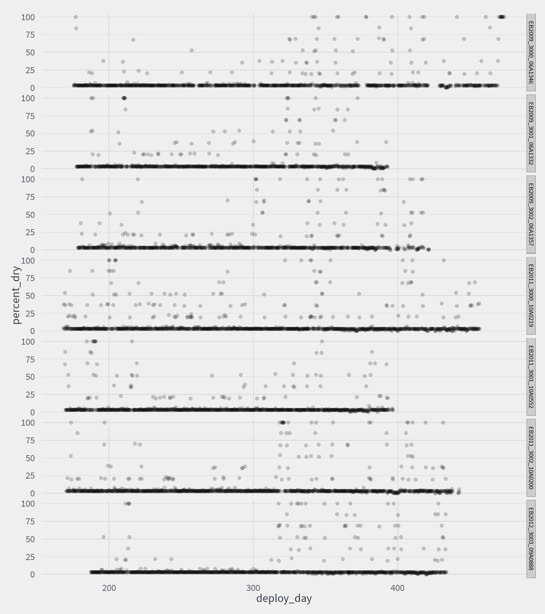
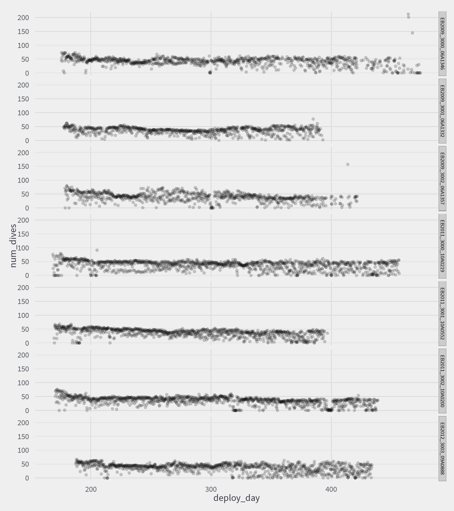
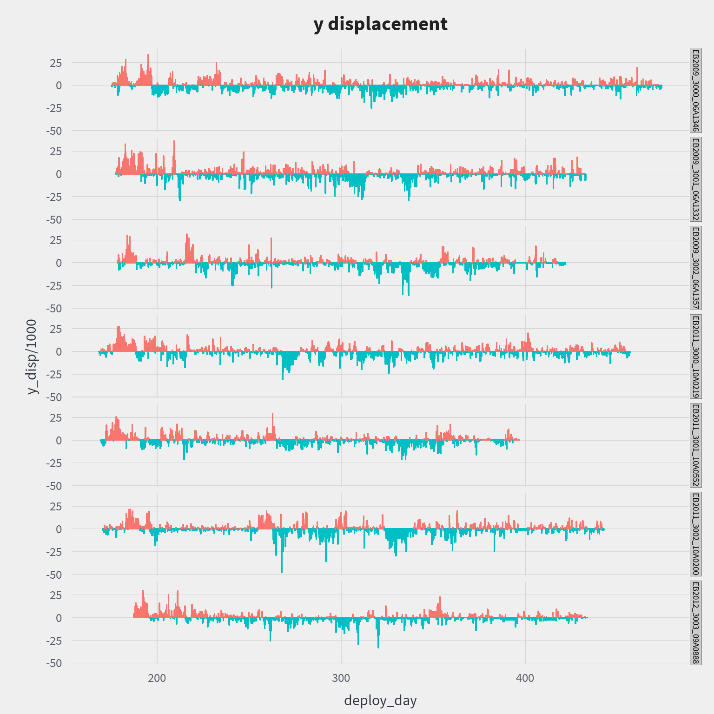
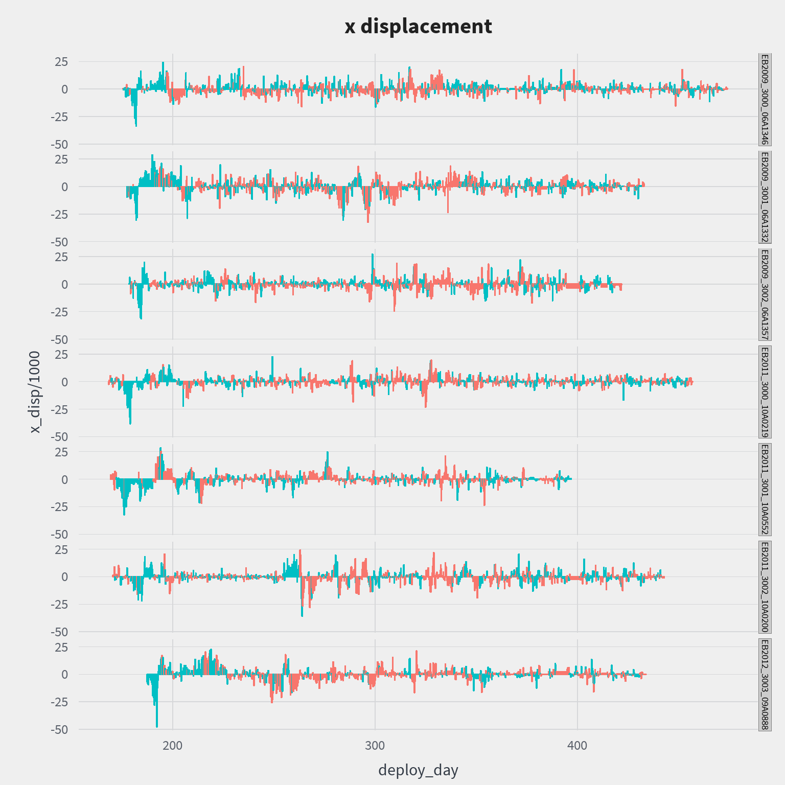
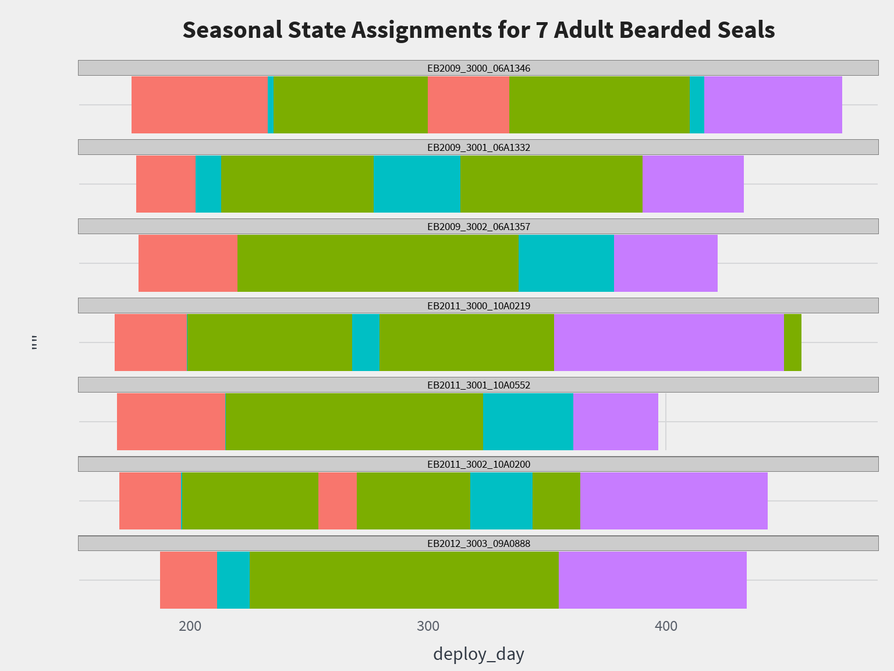
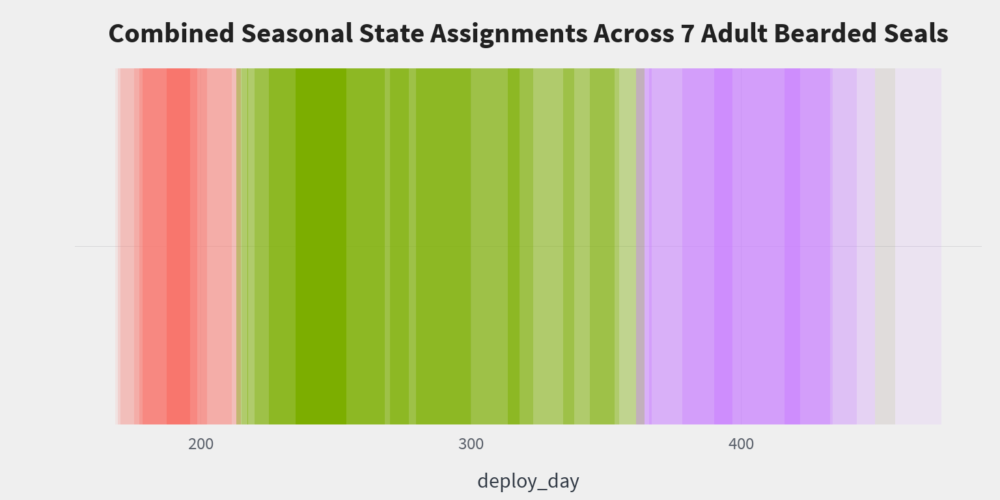
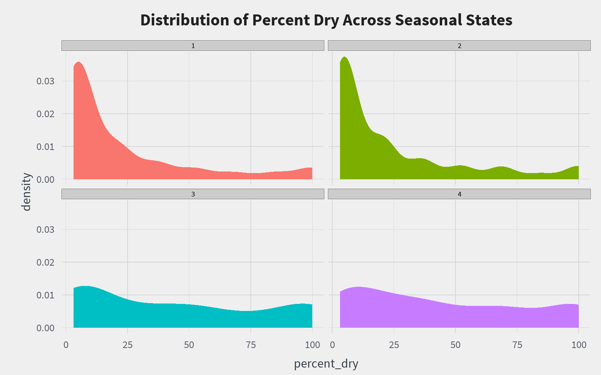
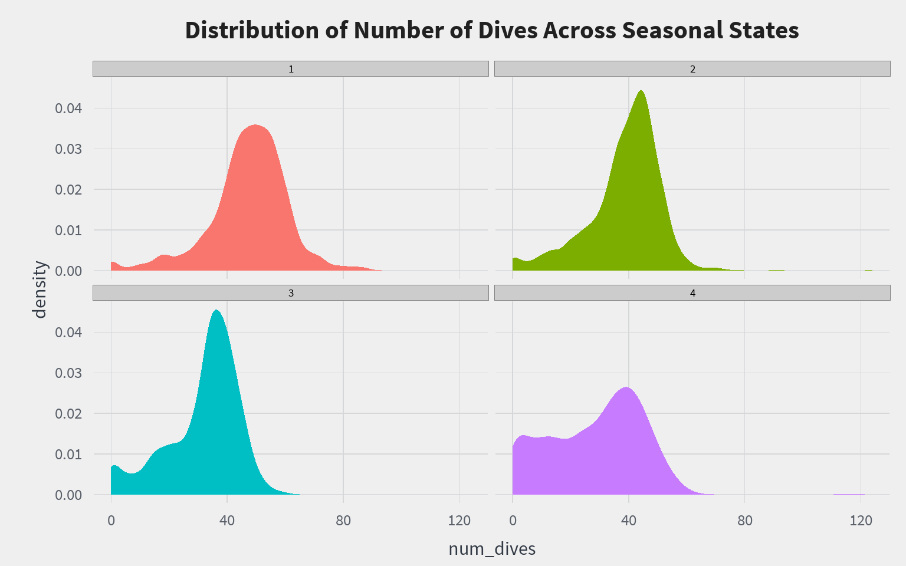
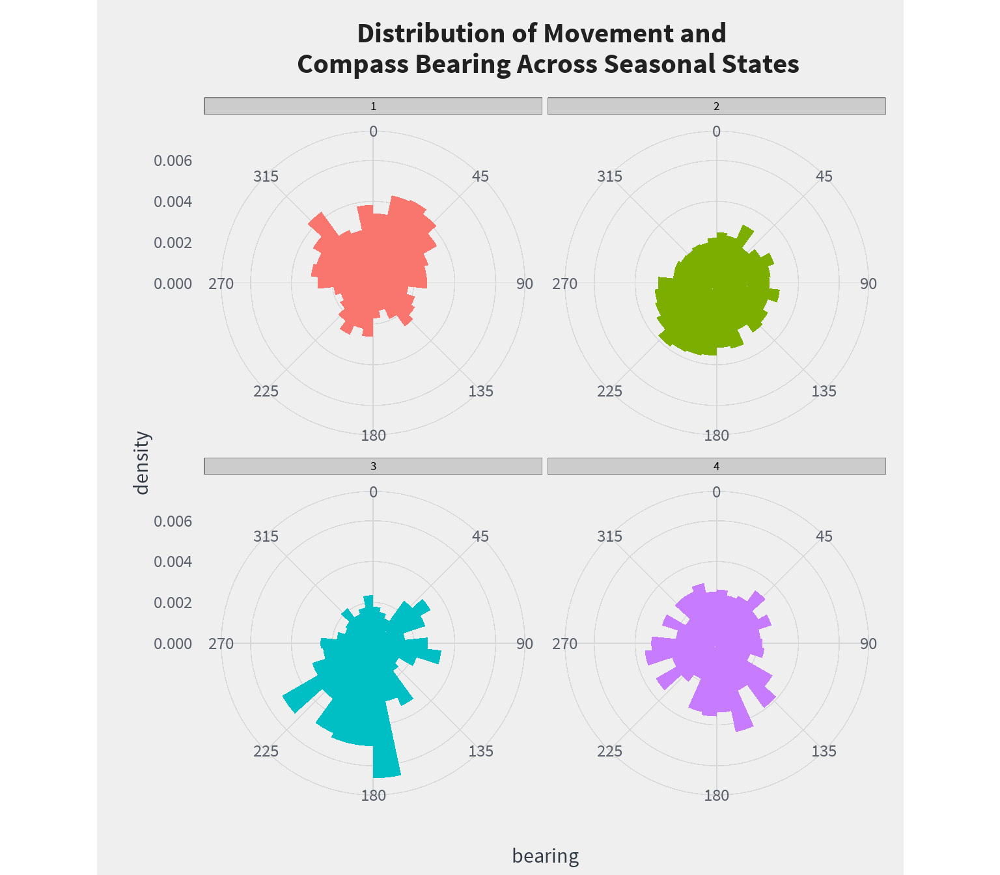

# Estimating Seasonal Behavior States from Biologging Sensor Data
`r format(Sys.time(), '%d %B, %Y')`  


## Introduction

Since 2006, over 128 ribbon and spotted seals have been captured and outfitted with bio-logging devices that measure hourly wet/dry proportions. In addition, seven adult bearded seals were released with bio-logging devices. The critical life history events of these seals are all associated with increased haul-out behavior and changes in dive behavior. Additionally, migratory-like movements are also key indications of seasonal states. Hidden Markov models require a geometrically distributed sojourn time in a given state. Hidden semi-Markov models allow an arbitrary sojourn distribution --- the duration an animal spends in a state can depend on the time it has already spent in that state. O’Connell et al (2010) applied Hidden semi-Markov models to the estrus detection in dairy cows and developed the `mhsmm` library for R to support similar analyses.


## Methods and Analysis

We will start by loading the bearded seal data from the `kotzeb0912` package along with other packages we'll need for the data munging and analysis. Data within this package have been processed through the Wildlife Computers Data Portal and additionally munged for more efficient incorporation into analyses like this.


### Model Seal Movement

The first step will be to load in the location data and run these data through the `crawl` package to model seal movement and estimate locations every 6 hours.

Prior to modeling the movement with `crawl`, we will use the `argosfilter` package to pass the Argos locations through a course speed filter (vmax=3.5 m/s).


```r
data(kotzeb0912_locs)

locs <- dplyr::filter(kotzeb0912_locs,instr=="Mk10") %>% 
  dplyr::arrange(deployid,unique_posix)
# speedfilter using the paralell package for multi-core speed
cfilter<-mclapply(split(locs,locs$deployid),function(x) sdafilter(
  lat=x$latitude, lon=x$longitude, dtime=x$unique_posix,
  lc=x$quality, ang=-1,vmax=3.5),mc.preschedule=F,mc.cores=3)
cfilter<-do.call("c",cfilter)
cfilter<-as.vector(cfilter)
locs$filtered <- cfilter

data <- filter(locs,filtered=="not", !is.na(error_semimajor_axis)) %>% arrange(deployid,unique_posix) %>% as.data.frame(.)
```

A few of the bearded seals were deployed with GPS capable tags and so we need to merge the GPS data with our Argos data.


```r
data(kotzeb0912_gps)

kotzeb0912_gps <- kotzeb0912_gps %>% 
  select(deployid,date_time,latitude,longitude) %>% 
  filter(!is.na(latitude)) %>% 
  rename(unique_posix=date_time) %>% 
  mutate(error_semimajor_axis = 50,error_semiminor_axis = 50, error_ellipse_orientation = 1) 

data <- data %>% bind_rows(kotzeb0912_gps) %>% 
  arrange(deployid,unique_posix)
```

The specifications for the movement model are fairly straightforward. Note we are using the development version of `crawl` and incorporating the error ellipse structure. The GPS locations were all given a fixed error of 50m.


```r
data <- as.data.frame(data)
coordinates(data) = ~longitude+latitude
proj4string(data) = CRS("+proj=longlat +datum=WGS84")

data=spTransform(data, CRS("+init=epsg:3571"))

## Loop over PTT and fit CTCRW models
ids = unique(data@data$deployid)

library(doParallel)
n.cores <- detectCores()
registerDoParallel(cores=3)

model_fits <-
  foreach(i = 1:length(ids)) %dopar% {
  id_data = subset(data,deployid==ids[i])
  diag_data = model.matrix(
      ~ error_semimajor_axis + error_semiminor_axis + error_ellipse_orientation,
      id_data@data
    )[,-1]
    
    id_data@data = cbind(id_data@data, 
                         argosDiag2Cov(
                           diag_data[,1], 
                           diag_data[,2], 
                           diag_data[,3]))
    
    init = list(a = c(coordinates(id_data)[1,1],0,
                      coordinates(id_data)[1,2],0),
                P = diag(c(5000 ^ 2,10 * 3600 ^ 2, 
                           5000 ^ 2, 10 * 3600 ^ 2)))
    
  fit <- crwMLE(
      mov.model =  ~ 1,
      err.model = list(
        x =  ~ ln.sd.x - 1, 
        y =  ~ ln.sd.y - 1, 
        rho =  ~ error.corr
      ),
      data = id_data,
      Time.name = "unique_posix",
      initial.state = init,
      fixPar = c(1,1,NA,NA),
      theta = c(log(10), 3),
      initialSANN = list(maxit = 2500),
      control = list(REPORT = 10, trace = 1)
    )
    fit
  }

names(model_fits) <- ids

print(model_fits)
```

### Predict locations every 6 hours

This function predicts the regular-timed -- in this case, 6-hourly -- locations along the movement path using the posterior mean and variance of the track. 


```r
predData <- foreach(i = 1:length(model_fits)) %dopar% {

  model_fits[[i]]$data$unique_posix <- lubridate::with_tz(
    model_fits[[i]]$data$unique_posix,"GMT")
  predTimes <- seq(
    lubridate::ceiling_date(min(model_fits[[i]]$data$unique_posix),"day"),
    lubridate::floor_date(max(model_fits[[i]]$data$unique_posix),"day"),
    "6 hours")
  tmp = crwPredict(model_fits[[i]], predTime=predTimes)
}


predData <- dplyr::bind_rows(predData) %>% 
  filter(locType=="p")

predData$predTimes <- intToPOSIX(predData$TimeNum)
```


### Merge predicted locations with haul-out data

The haul-out behavior timelines are provided as hour percent-dry values. We want to group these values into 6-hour blocks that are centered on our 6-hourly predictions. To accomplish this, we will setup a grouping column that assigns a unique integer to each 6 hour period.


### Merge predicted locations with dive behavior

Dive behavior data are transmitted as dive histograms that represent the distribution of dives across predetermined depth bins for a given 6-hour period. To simplify things, we will sum the number of dives across all bins less than 10m. This should represent the most likely number of foraging dives over a 6 hour period. Future analysis may consider using time-at-depth instead of number of dives.


```r
data(kotzeb0912_depths)

diveData <- kotzeb0912_depths %>% 
  filter(limits != "10.000000") %>% 
  mutate(datadatetime = datadatetime + lubridate::hours(3)) %>% 
  group_by(deployid,datadatetime) %>% 
  summarise(num_dives=sum(num_dives,na.rm=TRUE))

predData <- dplyr::left_join(predData,
                             diveData) %>% 
  tbl_df() %>% 
  arrange(deployid,datadatetime)
```

### Calculate x and y displacement for each step

We'll use the dplyr::lag() function to calculate the difference in x and y when compared with the previous x and y values. This will give us a measure of northing and easting displacement at each time step. These values will form the basis for our xy-displacement multi-variate normal parameter in the model.


```r
predData <- predData %>% 
  group_by(deployid) %>% 
  mutate(x_disp = order_by(datadatetime, mu.x - lag(mu.x)), 
         y_disp = order_by(datadatetime, mu.y - lag(mu.y))
  ) %>% 
  filter(!is.na(x_disp) | !is.na(y_disp))
```

We can use a custom function to calculate the compass bearing between those two points. Compass bearing provides a more user friendly description of movement compared to x/y displacement.


```r
anglefun <- function(xx,yy,bearing=TRUE,as.deg=FALSE){
  ## calculates the compass bearing of the line between two points
  ## xx and yy are the differences in x and y coordinates between two points
  ## Options:
  ## bearing = FALSE returns +/- pi instead of 0:2*pi
  ## as.deg = TRUE returns degrees instead of radians
  c = 1
  if (as.deg){
    c = 180/pi
  }
  
  b<-sign(xx)
  b[b==0]<-1  #corrects for the fact that sign(0) == 0
  tempangle = b*(yy<0)*pi+atan(xx/yy)
  if(bearing){
    #return a compass bearing 0 to 2pi
    #if bearing==FALSE then a heading (+/- pi) is returned
    tempangle[tempangle<0]<-tempangle[tempangle<0]+2*pi
  }
  return(tempangle*c)
}

predData <- predData %>% 
  mutate(bearing = anglefun(x_disp,y_disp,as.deg=TRUE))
```

### Add deploy_day for aligning deployments

Since these deployments occurred over multiple years, we will want a convenient way to align the deployments. The simplest way to do this is to use day-of-year integers and add 365 to days in January-May. At this point, we will also do some additional filtering to make sure we don't have any corrupt or other outlier parameters from the tag data.


```r
predData <- predData %>% 
  mutate(deploy_day = ifelse(lubridate::yday(datadatetime)<150, 
                      lubridate::yday(datadatetime)+365 +
                        lubridate::hour(datadatetime)/24,
                      lubridate::yday(datadatetime) +
                        lubridate::hour(datadatetime)/24)) %>% 
  mutate(num_dives = ifelse(deployid == "EB2009_3001_06A1332" & 
              datadatetime > lubridate::ymd_hms("2010-01-28 03:00:00"),
              NA,num_dives),
         ho_binary=ifelse(percent_dry>=33.3,1,-1)) %>% 
  mutate(y_disp = ifelse(abs(y_disp) > 100000,NA,y_disp ),
         x_disp = ifelse(abs(x_disp) > 100000,NA,x_disp)) %>% 
  mutate(num_dives = ifelse(num_dives>150 | is.na(num_dives),NA,num_dives)) 

save(predData,file='predData.rda')
```

We now present a series of four plots showing the raw, 'observed' parameter values that will go into the model: haul-out status, number of dives, y-displacement, and x-displacement.

 

 

 

 

### multivariate semi-hidden markov

We are going to use the mshmm package to run our multi-variate semi-hidden markov model. For the model, we will use 6-hour time steps and the following parameters:

#. haul-out status (Bernouli; cuttoff at 33.3% dry)
#. number of dives below 10m (Poisson)
#. x-y displacement (multi-variate normal)


```r
library(mhsmm)

id = levels(factor(predData$deployid))
predData$ind_dry = ifelse(predData$percent_dry>100/3, 1, 0)
predData$y_disp_km = predData$y_disp/1000
predData$x_disp_km = predData$x_disp/1000

tmp1 = predData#[predData$deployid==id[1],]

### MHSMM functions
source("mhsmm_functions.R")
```

After loading the package and doing a little bit of data cleaning, we need to setup the initial values and parameters. Initial investigation and model comparison with AIC suggests that 4 states provides the best model.


```r
# Number of states
J = 4

# Initial vals
init0 = rep(1/J, J)
B0 = list(
  p = c(0.05,0.05,0.07,0.1),
  lambda = rep(30, J), 
  mu = rep(list(c(0,0)), J),
  sigma = rep(list(20*diag(2)), J)
)
P0 = exp(-abs(row(diag(J)) - col(diag(J))))
diag(P0) = 0
P0 = sweep(P0, 1, rowSums(P0), "/")
S0 = list(lambda=rep(125, J), shift=rep(200,J), type="poisson")

start_val = hsmmspec(
  init = init0, 
  transition = P0, 
  parms.emission = B0, 
  sojourn = S0,
  dens.emission = dtelem.hsmm.mv, 
  mstep = mstep.telem.mv
)
```

Now, we can fit the model and predict


```r
# Fit model
data = list(x=with(tmp1, as.matrix(tmp1[,c("ind_dry","num_dives","x_disp_km","y_disp_km")])), N=table(tmp1$deployid))
fit = hsmmfit(data, start_val, mstep = mstep.telem.mv)

predData$state = predict(fit, data)$s
predData$state = as.factor(predData$state)
```

## Results

The results of the model fit are provided


```r
summary(fit)
```

```
## 
## Starting distribution = 
## [1] 1.0e+00 2.2e-17 1.1e-16 3.3e-16
## 
## Transition matrix = 
##          [,1] [,2]     [,3] [,4]
## [1,]  0.0e+00 0.80  2.0e-01 0.00
## [2,]  3.3e-01 0.00  4.4e-01 0.22
## [3,] 4.1e-171 0.17  0.0e+00 0.83
## [4,] 9.2e-162 1.00 4.4e-193 0.00
## 
## Sojourn distribution parameters = 
## $lambda
## [1] 189.23168 336.91253 152.55625  37.25037
## 
## $shift
## [1]   1   1   1 350
## 
## $type
## [1] "poisson"
## 
## 
## Emission distribution parameters = 
## $p
## [1] 0.05071424 0.04988405 0.11200105 0.09881559
## 
## $lambda
## [1] 45.64094 38.97205 31.41672 28.32736
## 
## $mu
## $mu[[1]]
## x_disp_km y_disp_km 
## 0.1228216 1.6044913 
## 
## $mu[[2]]
##  x_disp_km  y_disp_km 
## -0.1153172 -0.8675507 
## 
## $mu[[3]]
##  x_disp_km  y_disp_km 
## -0.8271174 -3.1150655 
## 
## $mu[[4]]
##    x_disp_km    y_disp_km 
##  0.003606569 -0.132129839 
## 
## 
## $sigma
## $sigma[[1]]
##            x_disp_km  y_disp_km
## x_disp_km 72.5862128 -0.3345089
## y_disp_km -0.3345089 76.4733011
## 
## $sigma[[2]]
##           x_disp_km y_disp_km
## x_disp_km 21.352452  2.779013
## y_disp_km  2.779013 25.114882
## 
## $sigma[[3]]
##           x_disp_km y_disp_km
## x_disp_km 46.682850  4.202389
## y_disp_km  4.202389 53.592668
## 
## $sigma[[4]]
##            x_disp_km  y_disp_km
## x_disp_km 12.0181703 -0.5699826
## y_disp_km -0.5699826 16.2324359
```

And, we can plot the state assignments for each bearded seal

 

We can also combine the state assignments across our tagged seals by taking the majority state for each time step. The color transparency is set to the proportion of animals represented by that majority state. Note that, some states may not be present in the combined graph.

 

Now that we have some seasonal states assigned, we can examine the distribution of various behaviors across those different states.

 

 

 


## Discussion


## References
